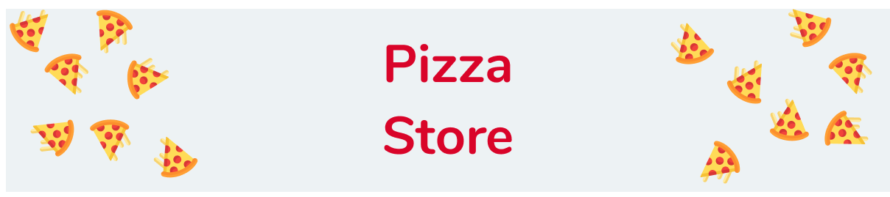

**Pizza Store** is a pizza delivery study project where the user can choose the pizzas they want and then buy them.  
See live on [Pizza Store 🔥](https://joaogabriel-sg.github.io/pizza-store/)

## 📚 What did I learn from the project?

- I learned how to use Sass and its features, like mixins
- Install and configure Gulp file and its plugins, such as gulp-sass and gulp-concat
- I learned how to use ESLint

## 🚀 Technologies

- HTML
- CSS
- JavaScript
- Sass
- Gulp
- ESLint

## 🎮 Getting started

1. Clone this repository using `git clone https://github.com/joaogabriel-sg/pizza-store.git`

1. Move yourself to the appropriate repository `cd pizza-store`

1. Run `npm i` to install the packages dependencies

1. If you want to modify any file, run `gulp watch`

## 📃 License

This project is licensed under the MIT License - see the [LICENSE](https://choosealicense.com/licenses/mit/) page for details.
